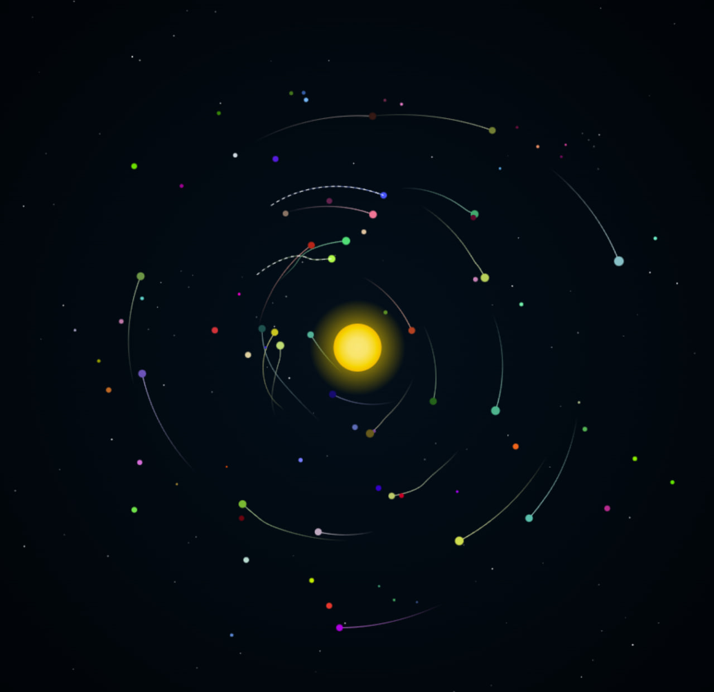

# Solar-System-simulation

A minimal, browser-based N-body demo where particles orbit a central star, collide, and form “planets” and moonlets.

**Live Demo:**  
https://shahryarfp.github.io/Solar-System-simulation/